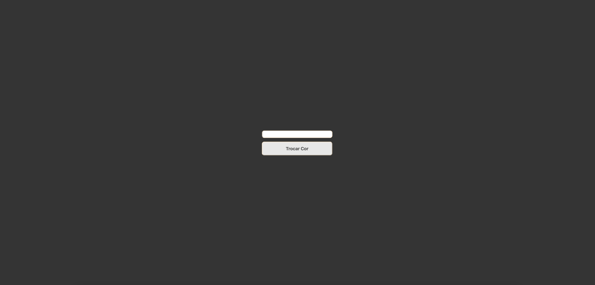

# troca-de-cores

## Projeto

Primeiro uso do JavaScript, um simples projeto que realiza a troca da cor do background.

## Tecnologias 

* JavaScript
* HTML
* CSS
* GIT

## Autor

[NIKOLAS FERNANDES](https://www.linkedin.com/in/nikolasfernnds/)